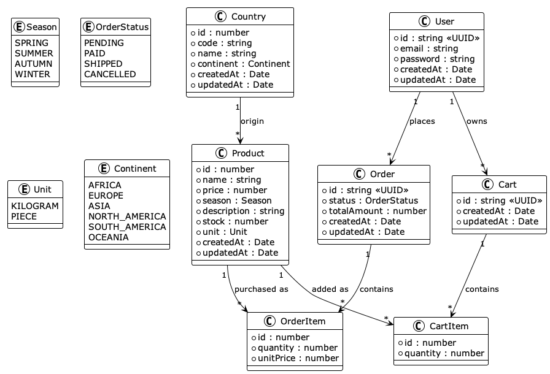
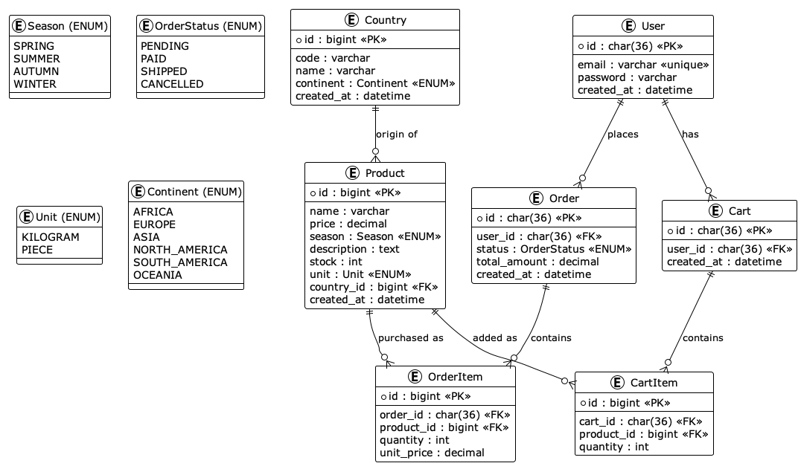

# Fruits Market - Version Starter Kit

Application e-commerce avec API REST (Catalogue de produits, Panier, Commandes, Authentification) et base de données MariaDB.

## Version de base (à compléter)

Cette version de l'application contient :

- Configuration __Docker Compose__ (API REST + Base de données MariaDB + Adminer) :
  - Configuration des dépendances entre services Docker entre (via depends_on et healthcheck),
  - Variables d'environnement :
    - api/.env
    - db/.env
- __API REST__ : application TypeScript (Hono)
  - Connexion à la base de données via __TypeORM__ (api/database/data-source.ts),
  - Configuration de l'entité __Product__ avec __TypeORM__(api/entities/Product.ts),
  - Configuration du routeur __products__ (routes préfixées par "/products"),
  - Handler __GetAllProducts__ (api/src/handlers/products/GetAllProducts.ts) associé à la route __HTTP GET /products__,
  - Mise en place de middlewares hono/cors, hono/secure-headers, hono/pretty-json, hono/trailing-slash ((api/src/app.ts))
  - Gestion centralisée des __erreurs 404__ avec __app.notFound__ (api/src/app.ts),
  - Gestion centralisée des __erreurs__ avec __app.onError__ (api/src/app.ts).
- Requêtes HTTP de test de l'API avec __Bruno__.

## Travail à réaliser

- Se connecter à __Adminer__ : <http://localhost:8080> (Serveur = db, cf. db/.env)
- Importer le fichier de données de test __db/product-data.sql__ dans la base de données (<http://localhost:8080/?server=db&username=fruits_market&db=fruits_market&import=>),
- Implémenter les __entitées__ manquantes :
  - Cart
  - CartItem
  - Country
  - Order
  - OrderItem
  - Product
  - User
- Implémenter les __handlers__ manquants :
  - auth
  - carts
  - countries
  - orders
  - products
- Implémenter le __middleware auth__ pour vérifier l'authentification

- Gérer les routes manquantes :
  - /products
  - /countries
  - /auth
  - /carts
  - /orders

## Architecture

- __API__ : Bun + TypeORM + Hono (port 3000)
- __Base de données__ : MariaDB
- __Adminer__ : Adminer (port 8080)

## Routes

### Routes Système

  | Méthode | Chemin  | Description                                   | Fichier        | Auth |
  |---------|---------|-----------------------------------------------|----------------|------|
  | GET     | /       | Message de bienvenue et statut de l'API       | api/src/app.ts | Non  |
  | GET     | /health | Vérification de santé (uptime, environnement) | api/src/app.ts | Non  |

### Routes d'Authentification (/auth)

  | Méthode | Chemin       | Description                               | Handler                 | Auth |
  |---------|--------------|-------------------------------------------|-------------------------|------|
  | POST    | /auth/signup | Inscription utilisateur (email, password) | handlers/auth/SignUp.ts | Non  |
  | POST    | /auth/signin | Connexion utilisateur (retourne JWT)      | handlers/auth/SignIn.ts | Non  |
  | GET     | /auth/me     | Récupérer l'utilisateur connecté          | handlers/auth/GetMe.ts  | Oui  |

### Routes Produits (/products)

  | Méthode | Chemin        | Description                         | Handler                             | Auth |
  |---------|---------------|-------------------------------------|-------------------------------------|------|
  | GET     | /products     | Liste tous les produits (avec pays) | handlers/products/GetAllProducts.ts | Non  |
  | GET     | /products/:id | Récupérer un produit par ID         | handlers/products/GetProductById.ts | Non  |
  | POST    | /products     | Créer un nouveau produit            | handlers/products/CreateProduct.ts  | Non  |
  | PUT     | /products/:id | Modifier un produit                 | handlers/products/UpdateProduct.ts  | Non  |
  | DELETE  | /products/:id | Supprimer un produit                | handlers/products/DeleteProduct.ts  | Non  |

### Routes Pays (/countries)

  | Méthode | Chemin         | Description                              | Handler                               | Auth |
  |---------|----------------|------------------------------------------|---------------------------------------|------|
  | GET     | /countries     | Liste tous les pays (triés par nom)      | handlers/countries/GetAllCountries.ts | Non  |
  | GET     | /countries/:id | Récupérer un pays par ID (avec produits) | handlers/countries/GetCountryById.ts  | Non  |
  | POST    | /countries     | Créer un nouveau pays                    | handlers/countries/CreateCountry.ts   | Non  |

### Routes Panier (/carts)

  Toutes ces routes nécessitent une authentification

  | Méthode | Chemin               | Description                          | Handler                          | Auth |
  |---------|----------------------|--------------------------------------|----------------------------------|------|
  | GET     | /carts               | Récupérer le panier de l'utilisateur | handlers/carts/GetCart.ts        | Oui  |
  | POST    | /carts/items         | Ajouter un produit au panier         | handlers/carts/AddToCart.ts      | Oui  |
  | PUT     | /carts/items/:itemId | Modifier la quantité d'un article    | handlers/carts/UpdateCartItem.ts | Oui  |
  | DELETE  | /carts/items/:itemId | Retirer un article du panier         | handlers/carts/RemoveFromCart.ts | Oui  |
  | DELETE  | /carts               | Vider complètement le panier         | handlers/carts/ClearCart.ts      | Oui  |

### Routes Commandes (/orders)

  Toutes ces routes nécessitent une authentification

  | Méthode | Chemin                  | Description                                 | Handler                              | Auth |
  |---------|-------------------------|---------------------------------------------|--------------------------------------|------|
  | GET     | /orders                 | Liste toutes les commandes de l'utilisateur | handlers/orders/GetAllOrders.ts      | Oui  |
  | GET     | /orders/:orderId        | Récupérer une commande spécifique           | handlers/orders/GetOrderById.ts      | Oui  |
  | POST    | /orders                 | Créer une commande depuis le panier         | handlers/orders/CreateOrder.ts       | Oui  |
  | PATCH   | /orders/:orderId/status | Mettre à jour le statut d'une commande      | handlers/orders/UpdateOrderStatus.ts | Oui  |

## Commandes Docker Compose

### Démarrer le projet

```bash
# Démarrer tous les services en arrière-plan
docker compose up -d

# Démarrer et voir les logs en temps réel
docker compose up

# Démarrer un service spécifique
docker compose up -d api
```

### Arrêter le projet

Se placer dans le terminal et saisir le raccourci clavier CTRL + C (identique Windows ou Mac).

```bash
# Arrêter tous les services

docker compose down

# Arrêter et supprimer les volumes (supprime les données)
docker compose down -v
```

### Reconstruire les images

```bash
# Reconstruire les images sans cache
docker compose build --no-cache

# Reconstruire et redémarrer
docker compose up -d --build
```

### Voir les logs

```bash
# Logs de tous les services
docker compose logs

# Logs en temps réel
docker compose logs -f

# Logs d'un service spécifique
docker compose logs -f api
```

### Gérer les services

```bash
# Redémarrer un service
docker compose restart api

# Stopper un service
docker compose stop api

# Démarrer un service stoppé
docker compose start api

# Voir l'état des services
docker compose ps
```

### Accéder aux conteneurs

```bash
# Ouvrir un shell dans le conteneur de l'API
docker compose exec api sh

# Ouvrir un shell dans la base de données
docker compose exec db bash

# Exécuter une commande dans un conteneur
docker compose exec api bun run test
```

### Import des données de test dans la base de données

```bash
# (remplacer les mots entourés de <> par la valeur, sans espace ni symboles <>)

docker exec -i <container name> mariadb -hlocalhost -u<database user> -p<mot de passe> <database name> < db/product-data.sql

# Exemple
docker exec -i fruits_market_db mariadb -hlocalhost -ufruits_market -pazerty123 fruits_market < db/product-data.sql

```

### Nettoyage

```bash
# Supprimer les conteneurs arrêtés, réseaux et images non utilisées
docker compose down --rmi all

# Nettoyer le système Docker complet (affecte tous les projets)
docker system prune -a --volumes
```

## Accès aux services

- __API__ : <http://localhost:3000>
- __Adminer__ : <http://localhost:8080>
- __Health check__ : <http://localhost:3000/health>

## Conception

### Modèle du Domaine - Diagramme UML de Classes



### Modèle du Domaine - Diagramme ERD



### Cas d'utilisation "Passer une commande" - Diagramme UML de Séquence


--


__Alexandre Leroux__
_Enseignant / Formateur_
_Développeur logiciel web & mobile_

Nancy (Grand Est, France)

<https://shrp.dev>
